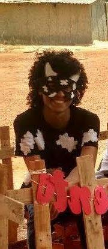

# Atividades Praticas de Processamento de Imagens

Está sendo feito em python, usando as libs que estão em ```requirements.txt```

#### Passos para rodar a aplicação

1. Clonar o repositório

2. Criar um virtualenv no diretório clonado com :
  
    ```python -m venv venv```

      Depois ativar o virtualenv no windows:

      ```venv\Scripts\activate.bat```
      ```venv\Scripts\activate.ps1```

3. Atualizar o pip:

    ```python -m pip install --upgrade pip```

4. Instalar as dependências no ```requirements.txt```:

    ```pip install -r requirements.txt```

4. Pronto 😁, só rodar a ```main.py```

### Coisas para ser implementadas

- [X] Interpolação
  - [X] Por vizinhos próximos (Aumento e diminuição)
  - [X] Bilinear (Aumento e diminuição)
- [X] Operações aritméticas:
  - [X] Adição
  - [X] Subtração
- [X] Operação geométrica:
  - [X] Espelhamento/Reflexão
- [X] Funções de transformação de intensidade:
  - [X] Negativa
  - [X] Equalização do histograma normalizado
- O futuro é incerto


## Exemplo 

  Ao se escolher as opções ```Reflexão/Espelhamento -> Espelhamento -> eu.jpg``` (achada na internet)``` -> Y``` com a imagem ```eu.jpg```, se tem o seguinte resultado: 

|  Entrada       |     Saída       | 
| ------------- |:-------------:|
|       |  |

O resultado aparece na tela, e no caso de ser selecionada a opção de salvar, ela é salva na pasta ```/out```
  

Coisas para talvez fazer no futuro:
  - Dividir a classe SimpleImage em classes menores
  - Implementar uma GUI
  - Permitir que sejam executadas várias operações em uma só execução do programa.
  - Logar de algum jeito as informações das imagens

Sendo feito por [matheuszinn](www.twitter.com/matheuszeen) e [thaís](https://twitter.com/thaisclxt) apenas.


A disciplina acabou, triste
